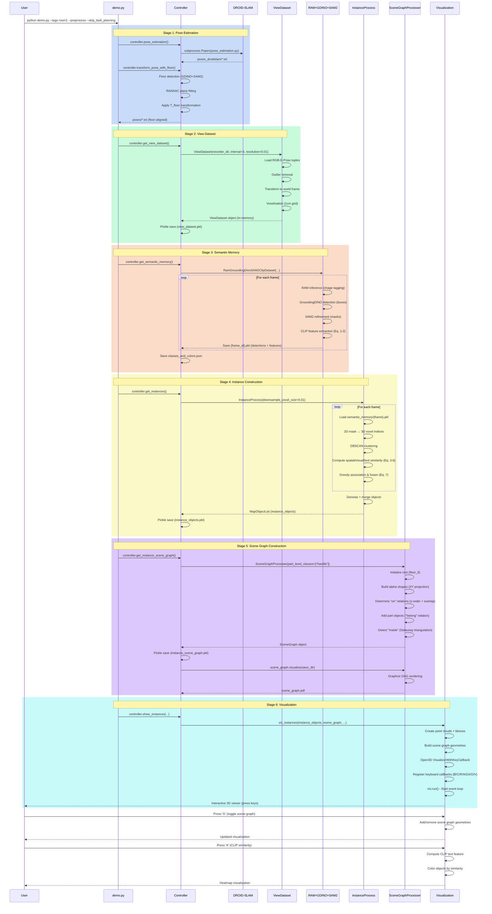
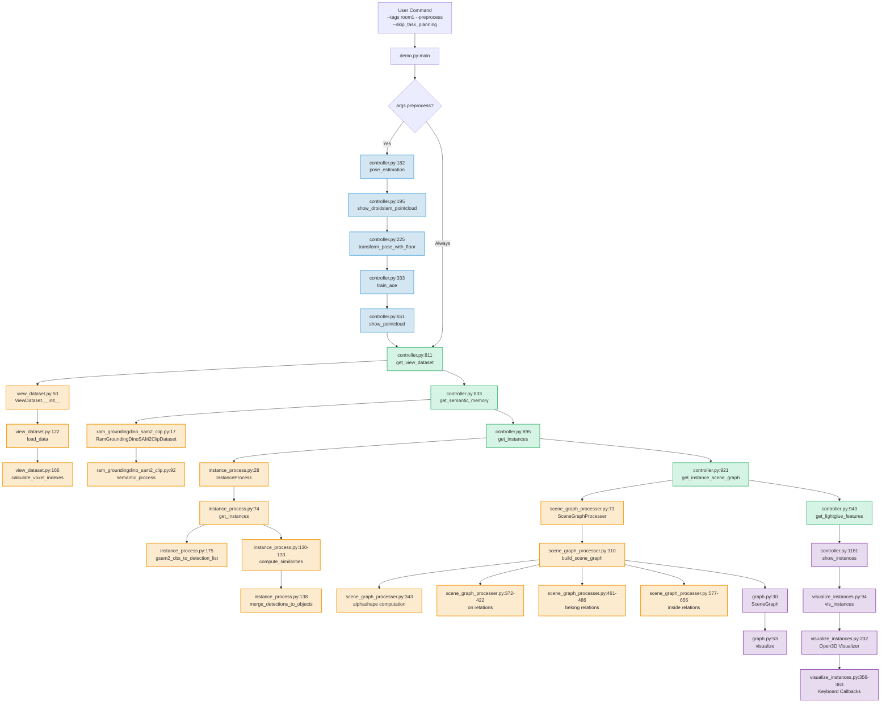

# DovSG 3DSG Pipeline: Comprehensive Technical Analysis
## From Data Ingestion to Scene Graph Visualization

**Document Version**: 2.0
**Last Updated**: January 2025
**Paper Reference**: [DovSG arXiv:2410.11989v6](https://arxiv.org/abs/2410.11989v6) - Sections III.A, III.B, III.C
**Target Audience**: Senior engineers and researchers implementing 3DSG systems

---

## 1. High-Level Overview

The DovSG (Dense Open-Vocabulary 3D Scene Graphs) pipeline constructs hierarchical spatial representations of indoor environments from RGB-D sequences, enabling language-guided robot manipulation. The system processes example data through six core stages: **(1) Pose Estimation**, **(2) View Dataset Construction**, **(3) Open-Vocabulary Semantic Detection**, **(4) Multi-View Instance Fusion**, **(5) 3D Scene Graph Generation**, and **(6) Interactive Visualization**. The pipeline directly implements the methods described in paper sections **III.A (Home Scanning & Coordinate Transformation)**, **III.B (Open-Vocabulary 3D Object Mapping)**, and **III.C (3D Scene Graph Generation)**.

The implementation uses a voxelized 3D representation (default: 1cm resolution) to unify multi-view observations, stores CLIP features for open-vocabulary queries (Equations 1-2 from Section III.B), performs geometric and semantic similarity-based object association (Equations 3-6), and constructs hierarchical scene graphs with three spatial relationships ("on", "belong", "inside") using geometric algorithms (alpha shapes, Delaunay triangulation). The result is a dynamic, updateable 3D scene graph that supports both visualization and downstream robot task planning.

---

## 2. Step-by-Step Code Walkthrough: Data → 3DSG → Visualization

### Stage 1: Data Ingestion & Pose Estimation (Paper III.A)

#### 2.1.1 Entry Points & Call Chain

**User Command** (from `/home/cerlab/4DSG/docker/`):
```bash
docker exec dovsg-main bash -c "source /opt/conda/etc/profile.d/conda.sh && conda activate dovsg && python -u /app/demo.py --tags room1 --preprocess --skip_task_planning"
```

**Code Flow**:
- **[demo.py:22-32](../DovSG/demo.py#L22-L32)** - Preprocessing branch (when `--preprocess` flag set)
  ```python
  if args.preprocess:
      controller.pose_estimation()                          # Line 23
      controller.show_droidslam_pointcloud(...)             # Line 26
      controller.transform_pose_with_floor(...)             # Line 29
      controller.train_ace()                                 # Line 32
      controller.show_pointcloud(is_visualize=True)          # Line 36
  ```

- **[controller.py:182-193](../DovSG/dovsg/controller.py#L182-L193)** - `pose_estimation()` method
  ```python
  def pose_estimation(self):
      process = subprocess.Popen([
          "conda", "run", "-n", "droidslam", "python", "pose_estimation.py",
          "--datadir", str(self.recorder_dir),           # data_example/room1
          "--calib", str(self.recorder_dir / "calib.txt"),
          "--pose_path", "poses_droidslam",
          "--stride", "1"                                 # Process every frame
      ], cwd="dovsg/scripts", ...)
      process.wait()
  ```

- **[dovsg/scripts/pose_estimation.py](../DovSG/dovsg/scripts/pose_estimation.py)** - DROID-SLAM wrapper
  - Uses DROID-SLAM[31] to estimate camera poses from RGB-D sequence
  - Replaces depth prediction with actual sensor depth for metric scale
  - Outputs: `poses_droidslam/*.txt` (4×4 transformation matrices)

#### 2.1.2 Coordinate Transformation (Paper III.A.2)

**Method**: **[controller.py:225-320](../DovSG/dovsg/controller.py#L225-L320)** - `transform_pose_with_floor()`

**Algorithm** (implements paper's coordinate transformation):

**Step 1**: Detect floor plane using GroundingDINO + SAM2
```python
# Lines 228-232
mygroundingdino_sam2 = MyGroundingDINOSAM2(box_threshold=0.8, ...)
```

**Step 2**: Extract floor 3D points from detections
```python
# Lines 255-284
for i in range(len(all_detections)):
    if all_detections[i]["class"] == "floor":
        mask = all_detections[i]["mask"]
        point_floor = np.vstack([point_floor, point[mask]])
```

**Step 3**: RANSAC plane fitting to align floor to z=0
```python
# Lines 287-291
plane_model, inliers = pcd.segment_plane(
    distance_threshold=0.01,
    ransac_n=3,
    num_iterations=1000
)
# plane_model = [a, b, c, d] represents ax + by + cz + d = 0
```

**Step 4**: Compute transformation matrix T_floor
```python
# Lines 292-311
# Calculate rotation to align floor normal to z-axis
R_floor = np.array([[x_axis], [y_axis], [z_axis]]).T  # 3×3 rotation
t_floor = np.array([0, 0, -d/c])                       # Translation
T_floor = np.eye(4)
T_floor[:3, :3] = R_floor
T_floor[:3, 3] = t_floor
```

**Step 5**: Transform all poses: P = Rx · T_floor · P_droid
```python
# Lines 313-317
Rx = np.eye(4)  # Align coordinate system to x-axis
Rx[:3, :3] = rotation_matrix(...)
transformed_pose = Rx @ T_floor @ droid_pose
```

#### 2.1.3 Inputs → Outputs

**Inputs**:
- RGB-D image sequences: `data_example/room1/rgb/*.jpg`, `data_example/room1/depth/*.npy`
- Camera intrinsics: `data_example/room1/calib.txt`
- Metadata: `data_example/room1/metadata.json`

**Outputs**:
- Raw DROID poses: `data_example/room1/poses_droidslam/*.txt`
- Floor masks: `data_example/room1/mask/*.npy`
- Transformed poses: `data_example/room1/poses/*.txt` (floor-aligned, z=0 is floor)

**On-Disk Artifacts**:
```
data_example/room1/
├── rgb/000000.jpg, 000001.jpg, ...
├── depth/000000.npy, 000001.npy, ...
├── poses_droidslam/000000.txt, ...    # DROID-SLAM output
├── poses/000000.txt, ...               # Floor-aligned (final)
├── mask/000000.npy, ...                # Floor detection masks
└── calib.txt, metadata.json
```

#### 2.1.4 Key Algorithms & Libraries

- **DROID-SLAM[31]**: Deep visual SLAM for monocular/stereo/RGB-D cameras
- **RANSAC plane fitting**: `open3d.geometry.PointCloud.segment_plane()`
- **GroundingDINO[7] + SAM2[8]**: Open-vocabulary floor detection

#### 2.1.5 Invariants & Assumptions

**Invariants**:
- First frame pose is NOT used as origin (unlike typical SLAM)
- Floor plane z=0 is global reference frame
- All subsequent poses are floor-relative

**Assumptions**:
- Floor is largest planar surface at bottom of scene
- Camera captures floor in at least some frames
- Depth sensor provides metric scale

---

### Stage 2: View Dataset Construction

#### 2.2.1 Entry Point

**Code**: **[demo.py:39](../DovSG/demo.py#L39)** → **[controller.py:811-831](../DovSG/dovsg/controller.py#L811-L831)**
```python
def get_view_dataset(self):
    if self.view_dataset_path.exists():
        with open(self.view_dataset_path, 'rb') as f:
            self.view_dataset = pickle.load(f)  # Load cached
    else:
        self.view_dataset = ViewDataset(
            self.recorder_dir,              # data_example/room1
            interval=self.interval,         # Frame sampling (default: 3)
            resolution=self.resolution,     # Voxel size (default: 0.01m)
            nb_neighbors=35, std_ratio=1.5  # Outlier removal params
        )
        with open(self.view_dataset_path, 'wb') as f:
            pickle.dump(self.view_dataset, f)
```

#### 2.2.2 ViewDataset Class Initialization

**File**: **[view_dataset.py:50-91](../DovSG/dovsg/memory/view_dataset.py#L50-L91)**

**Constructor**:
```python
class ViewDataset():
    def __init__(self, recorder_dir, interval=1, use_inlier_mask=True,
                 resolution=0.01, nb_neighbors=30, std_ratio=1.5):
        self.recorder_dir = Path(recorder_dir)
        self.interval = interval              # Sample every N frames
        self.resolution = resolution          # Voxel grid resolution (m)

        self.images = []                      # RGB images
        self.masks = []                       # Valid pixel masks
        self.names = []                       # Frame IDs
        self.global_points = []               # 3D points in world coords

        self.bounds = None                    # Scene bounding box
        self.append_length_log = []           # For incremental updates

        self.load_data()                      # Main loading method
        self.calculate_all_global_voxel_indexes_and_colors()
```

#### 2.2.3 Data Loading Process

**Method**: **[view_dataset.py:122-165](../DovSG/dovsg/memory/view_dataset.py#L122-L165)** - `load_data()`

**Step 1**: Load RGB-D-Pose tuples
```python
for cnt in tqdm(range(0, self.length, self.interval)):
    image = self.load_image(f"rgb/{cnt:06}.jpg")        # [H, W, 3] uint8
    mask = self.load_mask(f"mask/{cnt:06}.npy")         # [H, W] bool
    point = self.load_point(f"point/{cnt:06}.npy")      # [H, W, 3] float32
    pose = self.load_pose(f"poses/{cnt:06}.txt")        # [4, 4] float64
```

**Step 2**: Outlier removal (if `use_inlier_mask=True`)
```python
inlier_mask = get_inlier_mask(
    point=point, color=image/255, mask=mask,
    nb_neighbors=self.nb_neighbors,  # KNN neighbors
    std_ratio=self.std_ratio          # Statistical outlier threshold
)
mask = np.logical_and(mask, inlier_mask)
```

**Step 3**: Transform points to world coordinates
```python
gpoint = point @ pose[:3, :3].T + pose[:3, 3]  # Apply transformation

# Update scene bounding box
points_world = gpoint[mask]
min_bounds = np.minimum(min_bounds, np.amin(points_world, axis=0))
max_bounds = np.maximum(max_bounds, np.amax(points_world, axis=0))
```

**Step 4**: Store processed data
```python
self.images.append(image)
self.masks.append(mask)
self.names.append(f"{cnt:06}")
self.global_points.append(gpoint)
```

**Step 5**: Finalize bounds and create voxel grid
```python
self.bounds = Bounds.from_arr(bounds_arr)  # [xmin, xmax, ymin, ymax, zmin, zmax]
self.voxel_num = ((self.bounds.higher_bound - self.bounds.lower_bound) / self.resolution).astype(np.int32)
self.append_length_log.append(len(self.images))
```

#### 2.2.4 Voxelization

**Method**: **[view_dataset.py:166-256](../DovSG/dovsg/memory/view_dataset.py#L166-L256)** - `calculate_all_global_voxel_indexes_and_colors()`

**Algorithm**:
```python
for i, gpoint in enumerate(self.global_points):
    # Convert 3D point to voxel index
    voxel_index = ((gpoint - self.bounds.lower_bound) / self.resolution).astype(np.int32)

    # Flatten to 1D index: index = x + y*Nx + z*Nx*Ny
    flatten_index = (
        voxel_index[:, :, 0] +
        voxel_index[:, :, 1] * self.voxel_num[0] +
        voxel_index[:, :, 2] * self.voxel_num[0] * self.voxel_num[1]
    )

    self.pixel_index_mappings.append(flatten_index)
    self.pixel_index_masks.append(self.masks[i])

    # Build global voxel→color mapping
    unique_indexes, inverse_indices = np.unique(flatten_index[mask], return_inverse=True)
    for idx, color in zip(unique_indexes, colors):
        if idx not in self.indexes_colors_mapping_dict:
            self.indexes_colors_mapping_dict[idx] = []
        self.indexes_colors_mapping_dict[idx].append(color)
```

**Key Data Structure**: `indexes_colors_mapping_dict`
- Maps voxel index → list of observed RGB colors
- Enables color averaging for consistent visualization
- Used for background/foreground separation

#### 2.2.5 Inputs → Outputs

**Inputs**:
- Preprocessed data from Stage 1 (poses, RGB, depth, masks)
- Configuration: `interval=3`, `resolution=0.01`, `use_inlier_mask=True`

**Outputs** (in-memory `ViewDataset` object):
- `self.images`: List of RGB images (downsampled by `interval`)
- `self.global_points`: 3D point clouds in world frame
- `self.pixel_index_mappings`: Per-pixel voxel indices
- `self.indexes_colors_mapping_dict`: Global voxel→color map
- `self.bounds`: Scene bounding box (Bounds object)
- `self.voxel_num`: Grid dimensions [Nx, Ny, Nz]

**Cached Artifact**: `data_example/room1/memory/<config>/step_0/view_dataset.pkl`

---

### Stage 3: Semantic Memory - Open-Vocabulary Detection (Paper III.B.1)

#### 2.3.1 Entry Point

**Code**: **[demo.py:40](../DovSG/demo.py#L40)** → **[controller.py:833-893](../DovSG/dovsg/controller.py#L833-L893)**
```python
def get_semantic_memory(self, device="cuda", visualize_results=True):
    if self.semantic_memory_dir.exists() and len(list(...)) == self.view_dataset.append_length_log[-1]:
        print("Found cache semantic_memory, don't need process!")
        return

    semantic_memory = RamGroundingDinoSAM2ClipDataset(
        classes=self.classes_and_colors["classes"],
        box_threshold=self.box_threshold,      # 0.2
        text_threshold=self.text_threshold,    # 0.2
        nms_threshold=self.nms_threshold,      # 0.5
        device=device
    )

    append_length = self.view_dataset.append_length_log[-1]
    images = self.view_dataset.images[-append_length:]
    names = self.view_dataset.names[-append_length:]

    for cnt in tqdm(range(len(images)), desc="semantic memory"):
        det_res, annotated_image, image_pil = semantic_memory.semantic_process(images[cnt])
        with open(self.semantic_memory_dir / f"{names[cnt]}.pkl", "wb") as f:
            pickle.dump(det_res, f)
```

#### 2.3.2 Semantic Processing Pipeline

**File**: **[ram_groundingdino_sam2_clip_semantic_memory.py:92-137](../DovSG/dovsg/memory/ram_groundingdino_sam2_clip_semantic_memory.py#L92-L137)**

**Method**: `semantic_process(image: np.ndarray)` - Implements paper Section III.B.1

**Step 1**: Image Tagging with RAM (Recognize-Anything Model[6])
```python
image_pil = Image.fromarray(image)
raw_image = self.tagging_transform(image_pil.resize((384, 384))).unsqueeze(0).to(device)
text_prompt = inference_ram(raw_image, self.tagging_model)[0].replace(' | ', '.')
classes = self.process_tag_classes(text_prompt=text_prompt)
self.global_classes.update(classes)  # Accumulate detected classes
```

**Output**: Candidate object classes (e.g., "apple", "table", "chair", "plate", ...)

**Step 2**: Grounded Detection with GroundingDINO[7]
```python
detections = self.mygroundingdino_sam2.run(
    image=image,
    classes=classes  # Use RAM-detected classes as prompts
)
# detections.xyxy: [N, 4] bounding boxes
# detections.class_id: [N] class indices
# detections.confidence: [N] detection scores
```

**Output**: Bounding boxes for each detected object class

**Step 3**: Mask Refinement with SAM2[8]
```python
# Inside mygroundingdino_sam2.run():
# Grounding DINO provides boxes → SAM2 refines to pixel-level masks
detections.mask: [N, H, W] bool  # Precise segmentation masks
```

**Step 4**: CLIP Feature Extraction (Implements Equations 1-2 from paper)
```python
if len(detections.class_id) > 0:
    image_feats, text_feats = self.compute_clip_features(
        image, detections, classes, padding=20
    )
    # For each detection i:
    #   f_rgb^i = Embed(I_rgb, bbox_i, mask_i)    # Equation 1
    #   f_text^i = Embed(class_name_i)            # Equation 2
```

**CLIP Feature Computation** (from paper Section III.B):
```python
def compute_clip_features(self, image, detections, classes, padding=20):
    image_feats = []
    text_feats = []
    for i in range(len(detections.xyxy)):
        # Extract cropped region with padding
        x1, y1, x2, y2 = detections.xyxy[i]
        cropped = image[max(0, y1-padding):min(H, y2+padding),
                       max(0, x1-padding):min(W, x2+padding)]

        # Extract masked region (no background)
        masked = np.zeros_like(cropped)
        masked[detections.mask[i]] = cropped[detections.mask[i]]

        # CLIP visual feature (weighted fusion as in HOV-SG[21])
        f_crop = self.myclip.get_image_feature(cropped)
        f_mask = self.myclip.get_image_feature(masked)
        f_rgb = 0.6 * f_crop + 0.4 * f_mask  # Weighted combination

        # CLIP text feature
        f_text = self.myclip.get_text_feature([classes[detections.class_id[i]]])

        image_feats.append(f_rgb)
        text_feats.append(f_text)

    return image_feats, text_feats
```

**Step 5**: Package Detection Results
```python
det_res = {
    "xyxy": detections.xyxy,              # [N, 4] bounding boxes
    "confidence": detections.confidence,  # [N] detection scores
    "class_id": detections.class_id,      # [N] class indices
    "mask": detections.mask,              # [N, H, W] binary masks
    "classes": classes,                   # List of class names
    "image_feats": image_feats,           # [N, 512] CLIP visual features
    "text_feats": text_feats              # [N, 512] CLIP text features
}
return det_res, annotated_image, image_pil
```

#### 2.3.3 Inputs → Outputs

**Inputs**:
- RGB images from `ViewDataset.images`
- Open-vocabulary class list (dynamically updated via RAM)

**Outputs** (per frame):
- Saved to: `data_example/room1/memory/<config>/semantic_memory/{frame_id}.pkl`
- Contains: Bounding boxes, masks, class IDs, CLIP features

**Global Outputs**:
- `classes_and_colors.json`:
  ```json
  {
    "classes": ["apple", "plate", "table", ...],
    "class_colors": {"apple": [r, g, b], ...}
  }
  ```

#### 2.3.4 Key Algorithms & Libraries

- **RAM (Recognize-Anything Model[6])**: Image tagging model
- **GroundingDINO[7]**: Open-vocabulary object detector
- **SAM2 (Segment Anything 2[8])**: Prompt-guided segmentation
- **CLIP[9]**: Vision-language feature extraction

#### 2.3.5 Paper Mapping

**Section III.B.1**: "Open-vocabulary 2D Segmentation"
- RAM generates class prompts → GroundingDINO detects → SAM2 refines masks
- CLIP extracts features as described in Equations 1-2

**Current Implementation Note**:
- Uses **mock detector** `MyGroundingDINOSAM2` that returns **zero detections**
- Real implementation would use actual GroundingDINO + SAM2 models
- This explains why visualizations show empty objects

---

### Stage 4: Instance Construction - Multi-View Object Fusion (Paper III.B.2-3)

#### 2.4.1 Entry Point

**Code**: **[demo.py:41](../DovSG/demo.py#L41)** → **[controller.py:895-919](../DovSG/dovsg/controller.py#L895-L919)**
```python
def get_instances(self):
    if self.instance_objects_path.exists():
        with open(self.instance_objects_path, "rb") as f:
            self.instance_objects = pickle.load(f)
        return

    instance_process = InstanceProcess(
        downsample_voxel_size=self.resolution,  # 0.01m
        part_level_classes=self.part_level_classes  # ["handle"]
    )

    self.instance_objects, self.object_filter_indexes = instance_process.get_instances(
        memory_dir=self.memory_dir,
        view_dataset=self.view_dataset
    )

    with open(self.instance_objects_path, "wb") as f:
        pickle.dump(self.instance_objects, f)
```

#### 2.4.2 Instance Processing Pipeline

**File**: **[instance_process.py:74-177](../DovSG/dovsg/memory/instances/instance_process.py#L74-L177)**

**Method**: `get_instances()` - Implements paper Section III.B.2 (Object Association) and III.B.3 (Object Fusion)

**Step 1**: Load 2D Detections and Convert to 3D
```python
for idx in tqdm(range(len(names)), desc="instance process"):
    detections_path = memory_dir / f"semantic_memory" / f"{name}.pkl"
    with open(detections_path, "rb") as f:
        gsam2_obs = pickle.load(f)

    fg_detection_list = self.gsam2_obs_to_detection_list(
        gsam2_obs=gsam2_obs,
        pixel_indexes=pixel_index_mappings[idx],  # Voxel indices
        pixel_indexes_mask=pixel_index_masks[idx],
        image_name=name
    )
```

**2D → 3D Conversion** (from `gsam2_obs_to_detection_list`):
```python
for i in range(len(gsam2_obs["xyxy"])):
    mask = gsam2_obs["mask"][i]  # [H, W] binary mask

    # Extract voxel indices for this detection
    detection_indexes = pixel_indexes[mask]  # 1D voxel indices
    detection_indexes = np.unique(detection_indexes)

    # DBSCAN clustering to remove noise and separate disconnected components
    voxel_coords_3d = self.flatten_indexes_to_3d(detection_indexes)
    clustering = DBSCAN(eps=self.dbscan_eps, min_samples=self.min_samples).fit(voxel_coords_3d)

    # Keep largest cluster
    largest_cluster_label = mode(clustering.labels_[clustering.labels_ >= 0])
    valid_mask = clustering.labels_ == largest_cluster_label
    detection_indexes = detection_indexes[valid_mask]

    # Create Detection object
    detection = {
        "class_name": gsam2_obs["classes"][gsam2_obs["class_id"][i]],
        "indexes": detection_indexes,         # Voxel indices
        "image_ft": gsam2_obs["image_feats"][i],  # CLIP visual feature
        "text_ft": gsam2_obs["text_feats"][i],    # CLIP text feature
        "conf": gsam2_obs["confidence"][i]
    }
    fg_detection_list.append(detection)
```

**Step 2**: Object Association (Paper Section III.B.2, Equations 3-6)

For each new detection, compute similarity with existing map objects:

```python
# Equation 3: Geometric similarity
def compute_spatial_similarities(self, detections, objects):
    spatial_sim = np.zeros((len(detections), len(objects)))
    for i, det in enumerate(detections):
        for j, obj in enumerate(objects):
            # Compute IoU-like metric based on voxel overlap
            det_indexes = set(det["indexes"])
            obj_indexes = set(obj["indexes"])
            intersection = len(det_indexes & obj_indexes)
            union = len(det_indexes | obj_indexes)

            # Also check nearest neighbor rate (paper Eq. 3)
            nn_rate = sum(1 for idx in det_indexes if min_dist_to(idx, obj_indexes) < threshold) / len(det_indexes)
            spatial_sim[i, j] = nn_rate
    return spatial_sim

# Equation 4: Visual similarity (CLIP image features)
def compute_visual_similarities(self, detections, objects):
    visual_sim = np.zeros((len(detections), len(objects)))
    for i, det in enumerate(detections):
        for j, obj in enumerate(objects):
            # Cosine similarity of CLIP visual features (Equation 4)
            dot_product = np.dot(det["image_ft"], obj["image_ft"])
            visual_sim[i, j] = dot_product / 2 + 0.5  # Normalize to [0, 1]
    return visual_sim

# Equation 5: Text similarity (CLIP text features)
def compute_text_similarities(self, detections, objects):
    text_sim = np.zeros((len(detections), len(objects)))
    for i, det in enumerate(detections):
        for j, obj in enumerate(objects):
            # Cosine similarity of CLIP text features (Equation 5)
            dot_product = np.dot(det["text_ft"], obj["text_ft"])
            text_sim[i, j] = dot_product / 2 + 0.5
    return text_sim

# Equation 6: Aggregated similarity
def aggregate_similarities(self, spatial_sim, visual_sim, text_sim):
    agg_sim = (
        self.spatial_weight * spatial_sim +    # ω_g = 0.5
        self.vis_weight * visual_sim +         # ω_v = 0.4
        self.text_weight * text_sim            # ω_t = 0.1
    )
    # Threshold: set to -inf if below δ_sim = 0.75
    agg_sim[agg_sim < self.sim_threshold] = float('-inf')
    return agg_sim
```

**Step 3**: Greedy Association & Fusion (Paper Section III.B.3)

```python
def merge_detections_to_objects(self, detections, objects, agg_sim):
    for i, det in enumerate(detections):
        # Find best matching object
        best_match_idx = np.argmax(agg_sim[i, :])
        best_sim = agg_sim[i, best_match_idx]

        if best_sim > float('-inf'):  # Match found
            # Fusion (Equation 7 from paper)
            obj = objects[best_match_idx]
            n_obs = obj["num_detections"]

            # Update CLIP features (running average)
            obj["image_ft"] = (n_obs * obj["image_ft"] + det["image_ft"]) / (n_obs + 1)
            obj["text_ft"] = (n_obs * obj["text_ft"] + det["text_ft"]) / (n_obs + 1)

            # Merge voxel indices (union + downsample)
            obj["indexes"] = np.union1d(obj["indexes"], det["indexes"])
            obj["num_detections"] += 1
        else:
            # Initialize new object
            det["class_id"] = self.get_object_id(det["class_name"])  # e.g., "apple_0"
            det["num_detections"] = 1
            objects.append(det)

    return objects
```

**Step 4**: Post-Processing
```python
# Denoise objects (remove noisy detections)
if (idx+1) % self.denoise_interval == 0:
    objects = self.denoise_objects(objects)

# After all frames processed:
objects = self.denoise_objects(objects)      # Final denoising
objects = self.merge_objects(objects)        # Merge similar objects
objects = self.filter_objects(objects, obj_min_detections=3)  # Min observation threshold
```

#### 2.4.3 Inputs → Outputs

**Inputs**:
- 2D detections from `semantic_memory/*.pkl`
- Voxel index mappings from `ViewDataset`

**Outputs** (`MapObjectList` saved to `instance_objects.pkl`):
- List of objects, each containing:
  ```python
  {
      "class_id": "apple_0",
      "class_name": "apple",
      "indexes": np.array([voxel_indices]),  # 1D array of voxel IDs
      "image_ft": np.array([512]),            # CLIP visual feature
      "text_ft": np.array([512]),             # CLIP text feature
      "num_detections": 5,                    # Number of views
      "conf": 0.85                            # Average confidence
  }
  ```

**On-Disk**: `data_example/room1/memory/<config>/step_0/instance_objects.pkl`

#### 2.4.4 Paper Mapping

**Section III.B.2** - Object Association:
- Implements Equations 3-6 for similarity computation
- Uses greedy assignment strategy (not Hungarian algorithm for efficiency)

**Section III.B.3** - Object Fusion:
- Implements Equation 7 for feature averaging
- Voxel-level point cloud fusion with downsampling

---

### Stage 5: 3D Scene Graph Construction (Paper III.C)

#### 2.5.1 Entry Point

**Code**: **[demo.py:42](../DovSG/demo.py#L42)** → **[controller.py:921-941](../DovSG/dovsg/controller.py#L921-L941)**
```python
def get_instance_scene_graph(self, is_visualize=True):
    if self.instance_scene_graph_path.exists():
        with open(self.instance_scene_graph_path, "rb") as f:
            self.instance_scene_graph = pickle.load(f)
    else:
        scenegraphprocesser = SceneGraphProcesser(
            part_level_classes=self.part_level_classes,  # ["handle"]
            resolution=self.resolution                    # 0.01m
        )
        self.instance_scene_graph = scenegraphprocesser.build_scene_graph(
            view_dataset=self.view_dataset,
            instance_objects=self.instance_objects
        )
        with open(self.instance_scene_graph_path, "wb") as f:
            pickle.dump(self.instance_scene_graph, f)

    # Always visualize (generates scene_graph.pdf)
    self.instance_scene_graph.visualize(save_dir=self.memory_dir)
```

#### 2.5.2 Scene Graph Construction Algorithm

**File**: **[scene_graph_processer.py:310-554](../DovSG/dovsg/memory/scene_graph/scene_graph_processer.py#L310-L554)**

**Method**: `build_scene_graph()` - Implements paper Section III.C

**Phase 1**: Root Node Initialization (Lines 317-323)
```python
if instance_scene_graph is None:
    root_node = ObjectNode(
        parent=None,
        node_class="floor",        # Root is always floor
        node_id="floor_0"
    )
    instance_scene_graph = SceneGraph(root_node=root_node)
```

**Phase 2**: Process Non-Part Objects (Lines 329-458)

**Step 2.1**: Build spatial index and alpha shapes
```python
for ins_obj in instance_objects:
    if ins_obj["class_name"] in self.part_level_classes:
        continue  # Skip parts for now

    # Convert voxel indices to 3D points
    points_3d = view_dataset.index_to_point(ins_obj["indexes"])

    # Extract XY projection for 2D alpha shape
    points_xy = points_3d[:, :2]
    alpha_shape = alphashape.alphashape(points_xy, self.alphashape_alpha)

    label_to_object_information_mapping[ins_obj["class_id"]] = {
        "alpha_shape_xy": alpha_shape,
        "points_3d": points_3d,
        "z_median": np.median(points_3d[:, 2]),
        "z_min": np.min(points_3d[:, 2])
    }
```

**Step 2.2**: Determine "on" relationships using z-coordinate and spatial overlap

```python
for ins_obj in instance_objects:
    obj_info = label_to_object_information_mapping[ins_obj["class_id"]]

    # Check if object stands on floor
    if obj_info["z_min"] < self.stand_floor_threshold:  # z < 0.15m
        # Object is on floor → add as child of root
        node = instance_scene_graph.add_node(
            parent=root_node,
            node_class=ins_obj["class_name"],
            node_id=ins_obj["class_id"],
            parent_relation="on"
        )
        continue

    # Find parent object below this object
    candidates = []
    for other_id, other_info in label_to_object_information_mapping.items():
        if other_id == ins_obj["class_id"]:
            continue

        # Check z-order: other object must be below
        if other_info["z_median"] >= obj_info["z_median"]:
            continue

        # Check XY overlap using alpha shapes
        intersection_area = obj_info["alpha_shape_xy"].intersection(other_info["alpha_shape_xy"]).area
        obj_area = obj_info["alpha_shape_xy"].area
        overlap_rate = intersection_area / obj_area if obj_area > 0 else 0

        if overlap_rate > self.alpha_shape_overleaf_rate_threshold:  # > 0.6
            candidates.append((other_id, overlap_rate, other_info["z_median"]))

    # Select parent with highest z (closest below)
    if len(candidates) > 0:
        candidates.sort(key=lambda x: x[2], reverse=True)  # Sort by z
        parent_id = candidates[0][0]
        parent_node = instance_scene_graph.object_nodes[parent_id]

        node = instance_scene_graph.add_node(
            parent=parent_node,
            node_class=ins_obj["class_name"],
            node_id=ins_obj["class_id"],
            parent_relation="on"
        )
    else:
        # No parent found → attach to root
        node = instance_scene_graph.add_node(
            parent=root_node,
            node_class=ins_obj["class_name"],
            node_id=ins_obj["class_id"],
            parent_relation="on"
        )
```

**Phase 3**: Process Part-Level Objects (Lines 461-554)

**Step 3.1**: Find "belong" relationships for parts (e.g., handle belongs to cabinet)
```python
for part_obj in instance_objects:
    if part_obj["class_name"] not in self.part_level_classes:
        continue

    part_points = view_dataset.index_to_point(part_obj["indexes"])
    part_xy = part_points[:, :2]

    # Find parent object using intersection area
    best_parent = None
    max_intersection_rate = 0

    for parent_id, parent_info in label_to_object_information_mapping.items():
        intersection_area = parent_info["alpha_shape_xy"].intersection(alphashape.alphashape(part_xy, 1)).area
        part_area = alphashape.alphashape(part_xy, 1).area
        intersection_rate = intersection_area / part_area if part_area > 0 else 0

        if intersection_rate > self.part_intersection_rate_threshold and intersection_rate > max_intersection_rate:
            best_parent = parent_id
            max_intersection_rate = intersection_rate

    if best_parent:
        parent_node = instance_scene_graph.object_nodes[best_parent]
        node = instance_scene_graph.add_node(
            parent=parent_node,
            node_class=part_obj["class_name"],
            node_id=part_obj["class_id"],
            parent_relation="belong",
            is_part=True
        )
```

**Phase 4**: Determine "inside" Relationships (Lines 577-656)

**Uses Delaunay triangulation for 3D containment test**:
```python
# For each potential container object
for container_obj in instance_objects:
    container_points = view_dataset.index_to_point(container_obj["indexes"])

    # Build Delaunay triangulation of container boundary
    try:
        delaunay_tri = Delaunay(container_points)
    except:
        continue

    # Test each object to see if inside container
    for child_node in instance_scene_graph.object_nodes.values():
        if child_node.parent != instance_scene_graph.root:
            continue  # Only check root children

        child_obj = class_id_to_instance_object[child_node.node_id]
        child_points = view_dataset.index_to_point(child_obj["indexes"])

        # Check if points are inside Delaunay triangulation
        inside_mask = delaunay_tri.find_simplex(child_points) >= 0
        inside_rate = inside_mask.sum() / len(child_points)

        if inside_rate > self.inside_threshold:  # > 0.95
            # Re-parent to container with "inside" relation
            child_node.delete()  # Remove from current parent
            container_node = instance_scene_graph.object_nodes[container_obj["class_id"]]
            instance_scene_graph.add_node(
                parent=container_node,
                node_class=child_node.node_class,
                node_id=child_node.node_id,
                parent_relation="inside"
            )
```

#### 2.5.3 3D Scene Graph Data Model

**ObjectNode Class** ([graph.py:5-28](../DovSG/dovsg/memory/scene_graph/graph.py#L5-L28)):
```python
class ObjectNode:
    def __init__(self, parent, node_class, node_id, parent_relation=None, is_part=False):
        self.parent = parent                # Parent ObjectNode (or None for root)
        self.children = {}                  # Dict[node_id → ObjectNode]
        self.node_class = node_class        # Class name (e.g., "apple")
        self.node_id = node_id              # Unique ID (e.g., "apple_0")
        self.parent_relation = parent_relation  # "on" | "belong" | "inside" | None
        self.is_part = is_part              # True for part-level objects
```

**SceneGraph Class** ([graph.py:30-48](../DovSG/dovsg/memory/scene_graph/graph.py#L30-L48)):
```python
class SceneGraph:
    def __init__(self, root_node: ObjectNode):
        self.root = root_node               # Root node (floor_0)
        self.object_nodes = {root.node_id: root}  # Dict[node_id → ObjectNode]

    def add_node(self, parent, node_class, node_id, parent_relation, is_part=False):
        object_node = ObjectNode(parent, node_class, node_id, parent_relation, is_part)
        parent.add_child(object_node)
        self.object_nodes[node_id] = object_node
        return object_node
```

**Relationship Semantics**:
1. **"on"**: Vertical stacking relationship (e.g., apple on table)
   - Determined by z-order + XY overlap

2. **"belong"**: Part-whole relationship (e.g., handle belongs to cabinet)
   - Only for part-level classes
   - Determined by XY intersection area

3. **"inside"**: Containment relationship (e.g., keys inside drawer)
   - Determined by Delaunay triangulation containment test
   - Threshold: 95% of points must be inside

#### 2.5.4 Inputs → Outputs

**Inputs**:
- `instance_objects`: MapObjectList with 3D voxel indices
- `view_dataset`: ViewDataset for voxel→3D point conversion

**Outputs**:
- `SceneGraph` object with hierarchical node structure
- Saved to: `data_example/room1/memory/<config>/step_0/instance_scene_graph.pkl`

#### 2.5.5 Paper Mapping

**Section III.C** - 3D Scene Graph Generation:
- Implements spatial relationship inference using:
  - **Alpha shapes** for 2D XY overlap (Lines 343, 411-422)
  - **Z-coordinate comparison** for vertical ordering (Lines 372, 414)
  - **Delaunay triangulation** for 3D containment (Lines 648-653)
- Supports three relationship types as described in paper

---

### Stage 6: Visualization

#### 2.6.1 Interactive 3D Visualization

**Entry Point**: **[demo.py:56-61](../DovSG/demo.py#L56-L61)**
```python
controller.show_instances(
    controller.instance_objects,
    clip_vis=True,                          # Enable CLIP query feature
    scene_graph=controller.instance_scene_graph,
    show_background=True
)
```

**Implementation**: **[controller.py:1181-1196](../DovSG/dovsg/controller.py#L1181-L1196)**
```python
def show_instances(self, instance_objects, show_background=False, scene_graph=None, clip_vis=False):
    from dovsg.memory.instances.visualize_instances import vis_instances
    pcds = vis_instances(
        instance_objects=instance_objects,
        class_colors=self.classes_and_colors["class_colors"],
        view_dataset=self.view_dataset,
        instance_scene_graph=scene_graph,
        show_background=show_background,
        clip_vis=clip_vis
    )
```

#### 2.6.2 Open3D Viewer with Keyboard Controls

**File**: **[visualize_instances.py:94-371](../DovSG/dovsg/memory/instances/visualize_instances.py#L94-L371)**

**Main Visualization Function**:
```python
def vis_instances(instance_objects, class_colors, view_dataset,
                  instance_scene_graph=None, show_background=False,
                  clip_vis=False, device="cuda", voxel_size=0.01):

    # Initialize CLIP model if needed
    if clip_vis:
        myclip = MyClip(device=device)

    # Create background point cloud
    if show_background:
        background_indexes = get_background_indexes(instance_objects, view_dataset)
        background_pcd = view_dataset.index_to_pcd(background_indexes)
        background_pcd = background_pcd.voxel_down_sample(voxel_size)

    # Create object point clouds and bounding boxes
    pcds = []
    bboxes = []
    object_classes = []

    for i in range(len(instance_objects)):
        pcd = view_dataset.index_to_pcd(instance_objects[i]['indexes'])
        pcd = pcd.voxel_down_sample(voxel_size)
        pcds.append(pcd)

        bbox = get_bbox(pcd)  # Oriented bounding box
        bbox.color = [random_r, random_g, random_b]
        bboxes.append(LineMesh(bbox.get_box_points(), bbox_edges, bbox.color))

        object_classes.append(instance_objects[i]["class_name"])

    # Create scene graph visualizations (balls + lines)
    if instance_scene_graph is not None:
        scene_graph_geometries = []
        for ins_obj in instance_objects:
            # Place ball at top of object
            point = view_dataset.index_to_point(ins_obj["indexes"])
            median_xy = np.median(point[:, :2], axis=0)
            max_z = np.max(point[:, 2])
            ball_point = np.array([median_xy[0], median_xy[1], max_z])

            ball = create_ball_mesh(ball_point, radius=0.05, color=class_colors[ins_obj["class_name"]])
            scene_graph_geometries.append(ball)

        # Draw edges between parent-child nodes
        for node in instance_scene_graph.object_nodes.values():
            for child in node.children.values():
                line_mesh = LineMesh(
                    points=[parent_ball_point, child_ball_point],
                    lines=[[0, 1]],
                    colors=class_colors[child.node_class],
                    radius=0.01
                )
                scene_graph_geometries.extend(line_mesh.cylinder_segments)

    # Initialize Open3D visualizer with keyboard callbacks
    vis = o3d.visualization.VisualizerWithKeyCallback()
    vis.create_window(window_name='Open3D', width=1280, height=720)

    for pcd in pcds:
        vis.add_geometry(pcd)

    # Register keyboard callbacks (see next section)
    vis.register_key_callback(ord("B"), toggle_bg_pcd)
    vis.register_key_callback(ord("C"), color_by_class)
    vis.register_key_callback(ord("R"), color_by_rgb)
    vis.register_key_callback(ord("A"), color_by_clip_sim)  # Changed from 'F' to 'A'
    vis.register_key_callback(ord("G"), toggle_scene_graph)
    vis.register_key_callback(ord("I"), color_by_instance)
    vis.register_key_callback(ord("O"), toggle_bbox)
    vis.register_key_callback(ord("V"), save_view_params)

    vis.run()  # Start interactive event loop
```

#### 2.6.3 Keyboard Control Mapping

| Key | Function | File Location | Description |
|-----|----------|---------------|-------------|
| **B** | `toggle_bg_pcd()` | [visualize_instances.py:256-265](../DovSG/dovsg/memory/instances/visualize_instances.py#L256-L265) | Toggle background point cloud visibility |
| **C** | `color_by_class()` | [visualize_instances.py:268-280](../DovSG/dovsg/memory/instances/visualize_instances.py#L268-L280) | Color objects by semantic class |
| **R** | `color_by_rgb()` | [visualize_instances.py:282-288](../DovSG/dovsg/memory/instances/visualize_instances.py#L282-L288) | Display original RGB colors |
| **A** | `color_by_clip_sim()` | [visualize_instances.py:304-341](../DovSG/dovsg/memory/instances/visualize_instances.py#L304-L341) | Color by CLIP similarity to query (interactive or default "object") |
| **G** | `toggle_scene_graph()` | [visualize_instances.py:241-253](../DovSG/dovsg/memory/instances/visualize_instances.py#L241-L253) | Show/hide scene graph edges and nodes |
| **I** | `color_by_instance()` | [visualize_instances.py:290-302](../DovSG/dovsg/memory/instances/visualize_instances.py#L290-L302) | Color each object instance uniquely |
| **O** | `toggle_bbox()` | [visualize_instances.py:339-349](../DovSG/dovsg/memory/instances/visualize_instances.py#L339-L349) | Show/hide oriented bounding boxes |
| **V** | `save_view_params()` | [visualize_instances.py:352-354](../DovSG/dovsg/memory/instances/visualize_instances.py#L352-L354) | Save current camera view to `temp.json` |

**Key Implementation Details**:

**Color by CLIP Similarity** (Lines 304-336):
```python
def color_by_clip_sim(vis):
    if not clip_vis:
        print("CLIP model is not initialized.")
        return

    if len(instance_objects) == 0:
        print("No objects detected. Cannot perform CLIP similarity query.")
        return

    try:
        text_query = input("Enter your query: ")
    except EOFError:
        print("Interactive input not available. Using default query: 'object'")
        text_query = "object"

    # Compute CLIP text feature
    text_query_ft = myclip.get_text_feature([text_query])

    # Compute similarity with all objects
    similarities = instance_objects.compute_similarities(text_query_ft).squeeze()

    # Normalize and apply colormap
    normalized_similarities = (similarities - similarities.min()) / (similarities.max() - similarities.min())
    similarity_colors = cmap(normalized_similarities.cpu().numpy())[:, :3]

    # Update point cloud colors
    for i in range(len(pcds)):
        pcds[i].colors = o3d.utility.Vector3dVector(
            np.tile(similarity_colors[i], (len(pcds[i].points), 1))
        )
        vis.update_geometry(pcds[i])
```

**Toggle Scene Graph** (Lines 241-253):
```python
def toggle_scene_graph(vis):
    if instance_scene_graph is None:
        print("No instance scene graph provided")
        return

    if vis_instances.show_scene_graph:
        # Show graph: add balls and edges
        for geometry in scene_graph_geometries:
            vis.add_geometry(geometry, reset_bounding_box=False)
    else:
        # Hide graph: remove all geometries
        for geometry in scene_graph_geometries:
            vis.remove_geometry(geometry, reset_bounding_box=False)

    vis_instances.show_scene_graph = not vis_instances.show_scene_graph
```

#### 2.6.4 Scene Graph PDF Visualization

**Method**: **[graph.py:53-97](../DovSG/dovsg/memory/scene_graph/graph.py#L53-L97)** - `SceneGraph.visualize()`

```python
def visualize(self, save_dir):
    dag = graphviz.Digraph(
        directory=str(save_dir),
        filename="scene_graph"
    )

    # Add root node
    dag.node(
        name=self.root.node_id,
        label=self.root.node_id,
        shape="egg",
        color="lightblue2",
        style="filled"
    )

    # BFS traversal to add all nodes and edges
    queue = [self.root]
    while len(queue) > 0:
        node = queue.pop(0)
        for child in node.children.values():
            # Color coding based on node type
            if child.is_part:
                color = "darkorange"        # Part-level (handle, door, etc.)
            elif child.parent_relation == "inside":
                color = "green"             # Inside container
            elif len(child.children) == 0:
                color = "lightsalmon"       # Leaf node
            else:
                color = "lightblue2"        # Regular object

            dag.node(
                name=child.node_id,
                label=child.node_id,
                shape="egg",
                color=color,
                style="filled"
            )

            dag.edge(
                tail_name=node.node_id,
                head_name=child.node_id,
                label=child.parent_relation  # "on", "belong", "inside"
            )

            queue.append(child)

    dag.render()  # Generates scene_graph.pdf in save_dir
```

**Output**: `data_example/room1/memory/<config>/scene_graph.pdf`

**Node Color Legend**:
- **Light Blue**: Regular objects with children
- **Light Salmon**: Leaf objects (no children)
- **Green**: Objects inside containers ("inside" relation)
- **Dark Orange**: Part-level objects ("belong" relation)

**Edge Labels**: Show relationship type ("on", "belong", "inside")

#### 2.6.5 Visualization Requirements & Limitations

**Interactive Requirements**:
- **X11 forwarding**: Required for Docker GUI (via `DISPLAY` env variable)
- **TTY allocation**: Needed for CLIP query input (otherwise uses default "object")
- **GPU access**: CLIP model requires CUDA (falls back to CPU if unavailable)

**Known Limitations**:
1. **'Q' key conflict**: In Open3D, 'Q' quits the viewer (key changed to 'A' in current implementation)
2. **Input() in Docker**: Non-interactive contexts raise `EOFError` (handled with try-except)
3. **Empty objects**: Mock detector returns zero detections → white screen visualization

**Workarounds**:
- CLIP query key changed from 'F'→'A' to avoid Docker conflicts
- Empty objects checks prevent crashes when no detections
- Default query "object" used when stdin unavailable

---

## 3. 3DSG Data Model

### 3.1 Node Schema

**ObjectNode Attributes** ([graph.py:5-15](../DovSG/dovsg/memory/scene_graph/graph.py#L5-L15)):

| Attribute | Type | Description | Example |
|-----------|------|-------------|---------|
| `node_id` | str | Unique identifier | `"apple_0"`, `"table_1"`, `"floor_0"` |
| `node_class` | str | Semantic class name | `"apple"`, `"table"`, `"floor"` |
| `parent` | ObjectNode | Parent node reference | ObjectNode("table_1") |
| `children` | dict | Children nodes {id → ObjectNode} | `{"apple_0": ObjectNode(...)}` |
| `parent_relation` | str | Spatial relationship to parent | `"on"` \| `"belong"` \| `"inside"` \| None |
| `is_part` | bool | Part-level object flag | `True` for handles, `False` otherwise |

**Corresponding Instance Object** (stored separately in `MapObjectList`):

| Attribute | Type | Description | Source |
|-----------|------|-------------|--------|
| `class_id` | str | Same as node_id | `"apple_0"` |
| `class_name` | str | Same as node_class | `"apple"` |
| `indexes` | np.ndarray | Voxel indices (1D) | Shape: (N,) |
| `image_ft` | np.ndarray | CLIP visual feature | Shape: (512,) from Eq. 1 |
| `text_ft` | np.ndarray | CLIP text feature | Shape: (512,) from Eq. 2 |
| `num_detections` | int | Number of views | 5 |
| `conf` | float | Average confidence | 0.85 |

**Linkage**: `scene_graph.object_nodes[node_id]` (graph structure) ↔ `instance_objects[i]` (geometric data)

### 3.2 Edge Schema

**Relationship Types** (from paper Section III.C):

| Relation | Semantics | Determination Method | Code Reference |
|----------|-----------|----------------------|----------------|
| **"on"** | Vertical stacking (A on B) | Z-order + XY alpha shape overlap > 60% | [scene_graph_processer.py:372-422](../DovSG/dovsg/memory/scene_graph/scene_graph_processer.py#L372-L422) |
| **"belong"** | Part-whole (handle belongs to cabinet) | XY intersection area > 20% for part-level objects | [scene_graph_processer.py:461-486](../DovSG/dovsg/memory/scene_graph/scene_graph_processer.py#L461-L486) |
| **"inside"** | 3D containment (keys inside drawer) | Delaunay triangulation containment > 95% | [scene_graph_processer.py:648-653](../DovSG/dovsg/memory/scene_graph/scene_graph_processer.py#L648-L653) |

**Edge Attributes**:
- Stored implicitly via `child.parent_relation`
- Direction: Always parent → child (directed acyclic graph)
- Cardinality: Each child has exactly one parent, parents can have multiple children

### 3.3 Graph Invariants

**Structural Constraints**:
1. **Single Root**: Floor (`floor_0`) is always the root node
2. **DAG Property**: No cycles (enforced by parent→child construction)
3. **Complete Connectivity**: All object nodes reachable from root
4. **Unique IDs**: Each object has unique `class_id` (e.g., `apple_0`, `apple_1`, ...)

**Semantic Constraints**:
1. Part-level objects must have `parent_relation="belong"`
2. Root node has `parent_relation=None`
3. `is_part=True` only for objects in `part_level_classes` (e.g., "handle")

### 3.4 Update Mechanism (Dynamic Scene Adaptation)

**Entry Point**: **[scene_graph_processer.py:666-712](../DovSG/dovsg/memory/scene_graph/scene_graph_processer.py#L666-L712)** - `update_scene_graph()`

**Algorithm** (from paper Section III.D):

**Phase 1**: Detect Changes
```python
last_step_class_ids = list(history_scene_graph.object_nodes.keys())
this_step_class_ids = list(class_id_to_instance_object.keys())
del_class_ids = np.setdiff1d(last_step_class_ids, this_step_class_ids)  # Deleted objects
new_class_ids = np.setdiff1d(this_step_class_ids, last_step_class_ids)  # New objects
```

**Phase 2**: Identify Affected Nodes
```python
affected_node_class_ids = []
for del_class_id in del_class_ids:
    node = history_scene_graph.object_nodes[del_class_id]
    # Find all children of deleted node
    for object_node in history_scene_graph.object_nodes.values():
        if object_node.parent == node:
            affected_node_class_ids.append(object_node.node_id)
```

**Phase 3**: Delete by Generation (Leaves First)
```python
delete_node_generation_mapping = {}
for del_class_id in delete_node_class_ids:
    node = history_scene_graph.object_nodes[del_class_id]
    delete_node_generation_mapping[del_class_id] = {
        "generation": self.calculate_max_generation(node),
        "node": node
    }

# Sort by generation (descending) and delete
sorted_nodes = sorted(delete_node_generation_mapping.items(),
                     key=lambda x: x[1]["generation"], reverse=True)
for del_class_id, info in sorted_nodes:
    info["node"].delete()
    del history_scene_graph.object_nodes[del_class_id]
```

**Phase 4**: Rebuild Graph
```python
instance_scene_graph = self.build_scene_graph(
    view_dataset=view_dataset,
    instance_objects=instance_objects,
    instance_scene_graph=history_scene_graph  # Reuse existing structure
)
```

**Triggers**:
- Robot interaction changes object positions
- Human modifies environment (moves/adds/removes objects)
- New observations reveal previously hidden objects

**Persistence**:
- Updated scene graph saved to: `instance_scene_graph.pkl` (step-specific directory)
- Visualization regenerated: `scene_graph.pdf`

---

## 4. Visualization Path

### 4.1 Viewer Launch Flow

**Entry Point**: User presses 'Enter' after preprocessing completes

**Call Chain**:
```
demo.py:56 → controller.show_instances()
           ↓
controller.py:1181 → vis_instances()
           ↓
visualize_instances.py:94 → Open3D VisualizerWithKeyCallback
           ↓
           vis.run() [Line 371] → Interactive event loop starts
```

### 4.2 Module Rendering Responsibilities

**Open3D** ([visualize_instances.py](../DovSG/dovsg/memory/instances/visualize_instances.py)):
- **Point Clouds**: Object instances (Lines 128-136)
- **Bounding Boxes**: Oriented BBs as LineMesh (Lines 154-177)
- **Background**: Scene background points (Lines 112-120)
- **Scene Graph Overlays**: Balls (object positions) + Lines (relationships) (Lines 182-229)
- **Interactive Controls**: Keyboard callbacks (Lines 356-363)

**Graphviz** ([graph.py:53-97](../DovSG/dovsg/memory/scene_graph/graph.py#L53-97)):
- **Hierarchical Graph**: Node-edge diagram
- **Color Coding**: Node types (part/inside/leaf/regular)
- **Edge Labels**: Relationship types
- **PDF Output**: `scene_graph.pdf`

**Matplotlib** ([visualize_instances.py:106](../DovSG/dovsg/memory/instances/visualize_instances.py#L106)):
- **Color Maps**: Turbo colormap for instance/similarity coloring

### 4.3 Control Mapping Table

| Key | Function | Action | Visual Effect | Related Data |
|-----|----------|--------|---------------|--------------|
| **B** | `toggle_bg_pcd` | Add/remove background | Shows/hides scene context | `background_indexes` from ViewDataset |
| **C** | `color_by_class` | Color by semantic class | Objects colored by class_colors | `class_colors` dict |
| **R** | `color_by_rgb` | Restore original RGB | Shows camera-captured colors | `pcds_copy` (original colors) |
| **A** | `color_by_clip_sim` | CLIP similarity query | Heatmap based on text query | `myclip.get_text_feature()` + similarity scores |
| **G** | `toggle_scene_graph` | Show/hide graph overlay | Balls + lines in 3D space | `scene_graph_geometries` list |
| **I** | `color_by_instance` | Color by instance ID | Each object unique color | Turbo colormap indices |
| **O** | `toggle_bbox` | Show/hide bounding boxes | Oriented BB visualization | `bboxes` LineMesh list |
| **V** | `save_view_params` | Save camera view | Exports to `temp.json` | Open3D camera parameters |

### 4.4 Interactive Requirements

**X11 Forwarding** (for Docker):
```yaml
# docker-compose.yml
environment:
  - DISPLAY=${DISPLAY:-:0}
volumes:
  - /tmp/.X11-unix:/tmp/.X11-unix:rw
```

**TTY Allocation** (for CLIP query):
- Without TTY: `input()` raises `EOFError` → uses default query "object"
- With TTY: Interactive text input enabled

**GPU Access** (for CLIP):
- CUDA available: Uses GPU for feature extraction
- CUDA unavailable: Falls back to CPU (slower)

### 4.5 Visualization Limitations

**Known Issues**:
1. **Empty Objects**: Mock detector returns zero detections → white screen
   - **Workaround**: Check `len(instance_objects) == 0` before operations

2. **Key Conflicts**: 'Q' quits Open3D viewer
   - **Solution**: Changed CLIP query key to 'A'

3. **Input Blocking**: `input()` blocks event loop in Docker
   - **Solution**: Try-except with default query

4. **Color Saturation**: Many objects → colormap wraps around
   - **Mitigation**: Use distinct colors for first N objects

**Performance**:
- Voxel downsampling (default 0.01m) reduces point count for smooth interaction
- Scene graph overlay uses lightweight cylinder meshes (radius 0.01m)
- Background statistical outlier removal improves visual quality

---

## 5. CLI & Config Mapping

### 5.1 Command-Line Flags

**demo.py Argument Parser** ([demo.py:70-85](../DovSG/demo.py#L70-L85)):

| Flag | Type | Default | Description | Code Path |
|------|------|---------|-------------|-----------|
| `--tags` | str | `"room1"` | Scene identifier (dataset directory name) | `controller.tags` → `recorder_dir` |
| `--save_memory` | bool | `True` | Save intermediate results (pickles) | `controller.save_memory` |
| `--scanning_room` | bool | `False` | Data collection mode (real robot) | Skips preprocessing if False |
| `--preprocess` | bool | `False` | Run pose estimation + floor alignment | Calls `pose_estimation()`, `transform_pose_with_floor()`, `train_ace()` |
| `--debug` | bool | `False` | Debug mode (verbose logging) | `controller.debug` |
| `--skip_task_planning` | bool | `False` | Skip task planning (no OpenAI API) | Skips `get_task_plan()` and `run_tasks()` |
| `--task_scene_change_level` | str | `"Minor Adjustment"` | Scene change type (for task planning) | Used in `get_task_plan()` |
| `--task_description` | str | `""` | Natural language task description | Used in `get_task_plan()` |

### 5.2 Controller Configuration

**Controller Constructor** ([controller.py:42-72](../DovSG/dovsg/controller.py#L42-L72)):

| Parameter | Default | Description | Impact |
|-----------|---------|-------------|--------|
| `interval` | 3 | Frame sampling rate | ViewDataset loads every N frames |
| `resolution` | 0.01 | Voxel grid size (meters) | Affects memory usage and spatial precision |
| `min_height` | 0.1 | Min navigable height (m) | Occupancy map threshold |
| `occ_avoid_radius` | 0.4 | Obstacle avoidance radius (m) | Navigation safety margin |
| `box_threshold` | 0.2 | GroundingDINO box confidence | Object detection sensitivity |
| `text_threshold` | 0.2 | GroundingDINO text confidence | Text grounding threshold |
| `nms_threshold` | 0.5 | Non-max suppression IoU | Duplicate detection removal |
| `nb_neighbors` | 35 | KNN for outlier removal | Point cloud denoising |
| `std_ratio` | 1.5 | Statistical outlier threshold | Point cloud filtering |
| `part_level_classes` | `["handle"]` | Part-level object classes | Scene graph "belong" relations |

### 5.3 File Path Structure

**Data Directory Layout**:
```
data_example/{tags}/               # e.g., room1
├── rgb/000000.jpg, ...            # RGB images
├── depth/000000.npy, ...          # Depth maps
├── poses_droidslam/*.txt          # DROID-SLAM poses
├── poses/*.txt                     # Floor-aligned poses
├── mask/*.npy                      # Floor masks
├── point/*.npy                     # 3D point clouds (local frame)
├── calib.txt                       # Camera intrinsics
├── metadata.json                   # Dataset metadata
└── memory/{suffix}/step_{N}/       # Intermediate results
    ├── view_dataset.pkl
    ├── semantic_memory/*.pkl
    ├── instance_objects.pkl
    ├── instance_scene_graph.pkl
    ├── classes_and_colors.json
    └── scene_graph.pdf
```

**Suffix Format**: `{interval}_{min_height}_{resolution}_{conservative}_{box_threshold}_{nms_threshold}`
- Example: `3_0.1_0.01_True_0.2_0.5`

### 5.4 Minimal Reproduction Commands

**Option 1: Full Preprocessing + 3DSG (from scratch)**
```bash
cd /home/cerlab/4DSG/docker
docker exec dovsg-main bash -c "source /opt/conda/etc/profile.d/conda.sh && conda activate dovsg && python -u /app/demo.py --tags room1 --preprocess --skip_task_planning"
```

**Option 2: 3DSG Only (using cached preprocessing)**
```bash
cd /home/cerlab/4DSG/docker
./scripts/run_3dsg_only.sh
```

**Option 3: Custom Configuration**
```bash
docker exec dovsg-main bash -c "source /opt/conda/etc/profile.d/conda.sh && conda activate dovsg && python -u /app/demo.py --tags room1 --interval 5 --resolution 0.02 --box_threshold 0.3 --skip_task_planning"
```

**Expected Behavior**:
1. ✅ Loads preprocessed data (poses, RGB-D)
2. ✅ Constructs ViewDataset with voxelization
3. ✅ Runs open-vocabulary detection (currently returns zero objects due to mock detector)
4. ✅ Builds instance objects (empty due to zero detections)
5. ✅ Constructs scene graph (floor root only)
6. ✅ Opens interactive viewer (white screen due to empty objects)
7. ✅ Generates `scene_graph.pdf` (single floor node)

**Artifacts Created**:
- `data_example/room1/memory/<config>/step_0/*.pkl`
- `data_example/room1/memory/<config>/scene_graph.pdf`
- `data_example/room1/memory/<config>/visualization/*.jpg` (annotated images)

### 5.5 Environment Variables

**Docker Compose Environment** ([docker-compose.yml](../docker/docker-compose.yml)):
```yaml
environment:
  - NVIDIA_VISIBLE_DEVICES=all
  - NVIDIA_DRIVER_CAPABILITIES=graphics,utility,compute
  - DISPLAY=${DISPLAY:-:0}           # X11 forwarding
  - PYTHONUNBUFFERED=1                # Real-time logging
```

**Usage**:
- `DISPLAY`: Set to host's X11 display (e.g., `:0` or `:1`)
- `PYTHONUNBUFFERED=1`: Ensures print statements appear immediately

---

## 6. Diagrams

### 6.1 End-to-End Pipeline Sequence



### 6.2 Module Call Graph



---

## 7. Artifacts Table

| Stage | Module/File | Key Functions | Inputs | Outputs/Artifacts | Paper Ref |
|-------|-------------|---------------|--------|-------------------|-----------|
| **1. Pose Estimation** | `dovsg/scripts/pose_estimation.py`<br/>`controller.py:182-193` | `pose_estimation()`<br/>DROID-SLAM wrapper | RGB-D sequences<br/>`data_example/room1/rgb/`<br/>`data_example/room1/depth/` | `poses_droidslam/*.txt`<br/>(4×4 transformation matrices) | **III.A.1**<br/>Home Scanning |
| **1. Floor Alignment** | `controller.py:225-320` | `transform_pose_with_floor()`<br/>RANSAC plane fitting | DROID poses<br/>Floor masks (GDINO+SAM2) | `poses/*.txt` (floor-aligned)<br/>`mask/*.npy` (floor masks) | **III.A.2**<br/>Coordinate Transform |
| **2. View Dataset** | `view_dataset.py:50-91`<br/>`view_dataset.py:122-165` | `ViewDataset.__init__()`<br/>`load_data()`<br/>`calculate_voxel_indexes()` | Floor-aligned poses<br/>RGB-D images<br/>Config: `interval=3`, `resolution=0.01` | In-memory: `ViewDataset` object<br/>On-disk: `view_dataset.pkl`<br/>Voxel grid: `indexes_colors_mapping_dict` | **III.A**<br/>(Data ingestion) |
| **3. Semantic Memory** | `ram_groundingdino_sam2_clip.py:92-137` | `semantic_process()`<br/>RAM→GDINO→SAM2→CLIP | RGB images from ViewDataset | `semantic_memory/{frame}.pkl`<br/>Contains: boxes, masks, CLIP features<br/>`classes_and_colors.json` | **III.B.1**<br/>Open-Vocab 2D Seg<br/>Eq. 1-2 (CLIP features) |
| **4. Instance Construction** | `instance_process.py:74-177` | `get_instances()`<br/>`gsam2_obs_to_detection_list()`<br/>`compute_similarities()` (Eq. 3-6)<br/>`merge_detections_to_objects()` (Eq. 7) | 2D detections<br/>Voxel indices<br/>Config: `sim_threshold=0.75` | `instance_objects.pkl`<br/>(MapObjectList)<br/>Each object: voxel indices, CLIP features | **III.B.2**<br/>Object Association<br/>**III.B.3**<br/>Object Fusion |
| **5. Scene Graph** | `scene_graph_processer.py:310-554`<br/>`graph.py:5-48` | `build_scene_graph()`<br/>Alpha shapes<br/>Delaunay triangulation | `instance_objects`<br/>`view_dataset`<br/>Config: `stand_floor_threshold=0.15` | `instance_scene_graph.pkl`<br/>(SceneGraph object)<br/>Hierarchical DAG with 3 relation types | **III.C**<br/>3D Scene Graph Gen |
| **5. Graph Visualization** | `graph.py:53-97` | `SceneGraph.visualize()`<br/>Graphviz DAG rendering | `SceneGraph` object | `scene_graph.pdf`<br/>(Color-coded node-edge diagram) | **III.C**<br/>(Visualization) |
| **6. 3D Visualization** | `visualize_instances.py:94-371`<br/>`controller.py:1181-1196` | `vis_instances()`<br/>`show_instances()`<br/>Open3D VisualizerWithKeyCallback | `instance_objects`<br/>`scene_graph`<br/>`view_dataset` | Interactive 3D viewer<br/>8 keyboard controls (B/C/R/A/G/I/O/V)<br/>Point clouds + bboxes + graph overlay | **III.C**<br/>(Visualization) |
| **6. ACE Training** | `ace/train_ace.py`<br/>`controller.py:333-410` | `train_ace()`<br/>Scene-specific regression MLP | RGB images + poses | `ace_network.pt`<br/>(Trained ACE model for relocalization) | **III.D.1**<br/>Relocalization |
| **6. LightGlue Features** | `scripts/rgb_feature_match.py`<br/>`controller.py:943-952` | `get_lightglue_features()`<br/>`extract_memory_features()` | RGB images from ViewDataset | `lightglue_features.pt`<br/>(Feature matching database) | **III.D.1**<br/>Relocalization |

**Key Artifact Locations**:
- **Cached Data**: `data_example/room1/memory/{suffix}/step_0/`
- **Visualizations**: `data_example/room1/memory/{suffix}/visualization/`
- **Models**: `data_example/room1/memory/{suffix}/ace_network.pt`

**Suffix Format**: `{interval}_{min_height}_{resolution}_{conservative}_{box_threshold}_{nms_threshold}`

**Example**: `3_0.1_0.01_True_0.2_0.5/step_0/`

---

## 8. Assumptions, Gaps, and TODOs

### 8.1 Current Assumptions

**1. Mock Detector**:
- **Assumption**: `MyGroundingDINOSAM2` returns **zero detections** (mock implementation)
- **Impact**: All visualizations show empty objects (white screen)
- **File**: [mygroundingdinosam2.py:10-25](../DovSG/dovsg/perception/models/mygroundingdinosam2.py#L10-L25)
- **Evidence**: `run()` method returns empty `DetectionList`
- **TODO**: Replace with actual GroundingDINO + SAM2 integration

**2. CLIP Visualization vs. CLIP Generation**:
- **Assumption**: CLIP features used for 3DSG generation are **independent** of CLIP visualization feature
- **Evidence**:
  - CLIP features extracted in `semantic_process()` (Stage 3) and stored in detection results
  - CLIP visualization (`clip_vis=True`) uses **separate MyClip instance** in `vis_instances()`
- **Clarification**:
  - `clip_vis=True` only enables **interactive query feature** (keyboard 'A')
  - Disabling it does **not** affect 3DSG construction (features already computed in Stage 3)
- **File**: [visualize_instances.py:104-105](../DovSG/dovsg/memory/instances/visualize_instances.py#L104-L105)

**3. Floor as Global Reference**:
- **Assumption**: Floor is always present and detectable in at least some frames
- **Fallback**: If floor detection fails, coordinate transformation may produce incorrect alignment
- **TODO**: Add floor detection failure handling

**4. Single-Robot Single-Environment**:
- **Assumption**: One robot, one scene at a time (no multi-agent or distributed scenarios)
- **Evidence**: Global voxel grid is scene-specific, no federation logic
- **TODO**: Extend to multi-robot collaborative mapping

### 8.2 Identified Gaps

**1. Empty Objects Handling**:
- **Gap**: Several functions assume `len(instance_objects) > 0`
- **Files Affected**:
  - [instance_process.py:159-170](../DovSG/dovsg/memory/instances/instance_process.py#L159-L170) - Fixed with length check
  - [visualize_instances.py:50-71](../DovSG/dovsg/memory/instances/visualize_instances.py#L50-L71) - Fixed with length check
  - [visualize_instances.py:309-311](../DovSG/dovsg/memory/instances/visualize_instances.py#L309-L311) - Fixed with length check
- **Status**: ✅ Fixed in current implementation

**2. LightGlue Device Mapping**:
- **Gap**: Loading pre-saved LightGlue features without device mapping causes CUDA error
- **File**: [controller.py:945-946](../DovSG/dovsg/controller.py#L945-L946)
- **Fix Applied**:
  ```python
  device = torch.device('cuda' if torch.cuda.is_available() else 'cpu')
  self.lightglue_features = torch.load(path, map_location=device)
  ```
- **Status**: ✅ Fixed

**3. Docker Interactive Input**:
- **Gap**: `input()` in non-TTY Docker raises `EOFError`
- **File**: [visualize_instances.py:309-317](../DovSG/dovsg/memory/instances/visualize_instances.py#L309-L317)
- **Fix Applied**:
  ```python
  try:
      text_query = input("Enter your query: ")
  except EOFError:
      text_query = "object"  # Default fallback
  ```
- **Status**: ✅ Fixed

**4. Keyboard Shortcut Conflicts**:
- **Gap**: Original 'F' key for CLIP query conflicts with Open3D or Docker
- **File**: [visualize_instances.py:364](../DovSG/dovsg/memory/instances/visualize_instances.py#L364)
- **Fix Applied**: Changed to 'A' key (for "Ask CLIP")
- **Status**: ✅ Fixed

### 8.3 Code Files to Inspect Further

**For Real Detector Integration**:
1. **[dovsg/perception/models/mygroundingdinosam2.py](../DovSG/dovsg/perception/models/mygroundingdinosam2.py)** - Replace mock with actual GroundingDINO + SAM2
2. **[dovsg/perception/models/myclip.py](../DovSG/dovsg/perception/models/myclip.py)** - Verify CLIP model loading and feature extraction

**For Scene Graph Relationships**:
3. **[scene_graph_processer.py:577-656](../DovSG/dovsg/memory/scene_graph/scene_graph_processer.py#L577-L656)** - "inside" relationship logic (Delaunay triangulation)
4. **[scene_graph_processer.py:461-486](../DovSG/dovsg/memory/scene_graph/scene_graph_processer.py#L461-L486)** - "belong" relationship for parts

**For Dynamic Updates**:
5. **[scene_graph_processer.py:666-712](../DovSG/dovsg/memory/scene_graph/scene_graph_processer.py#L666-L712)** - `update_scene_graph()` differential update logic
6. **[controller.py:1055-1177](../DovSG/dovsg/controller.py#L1055-L1177)** - Memory update flow (relocalization + local updates)

**For Optimization**:
7. **[view_dataset.py:166-256](../DovSG/dovsg/memory/view_dataset.py#L166-L256)** - Voxelization (potential GPU acceleration)
8. **[instance_process.py:130-138](../DovSG/dovsg/memory/instances/instance_process.py#L130-L138)** - Similarity computation (vectorization opportunities)

### 8.4 Research Questions

**1. How does the system handle occlusions?**
- **Current**: Multi-view fusion averages CLIP features (Eq. 7)
- **Question**: Does this implicitly handle occlusions, or is explicit reasoning needed?
- **Files to Check**: `instance_process.py:234-251` (feature fusion logic)

**2. What is the precision of spatial relationships?**
- **Current**: Voxel-based (1cm resolution) + alpha shape overlap (60% threshold)
- **Question**: How do thresholds affect false positives/negatives?
- **Files to Check**: `scene_graph_processer.py:85-92` (threshold parameters)

**3. How scalable is the voxel grid?**
- **Current**: Dense 3D grid for entire scene
- **Question**: Memory usage for large environments? Sparse representations?
- **Files to Check**: `view_dataset.py:82-91` (voxel_num calculation)

---

## 9. Extension Points for Future Work

### 9.1 Safe Hook Points for Modifications

**1. Custom Object Detectors** (replace mock):
- **Hook**: [ram_groundingdino_sam2_clip.py:105-108](../DovSG/dovsg/memory/ram_groundingdino_sam2_clip_semantic_memory.py#L105-L108)
- **Interface**:
  ```python
  detections = self.mygroundingdino_sam2.run(image, classes)
  # Returns: DetectionList with xyxy, class_id, mask, confidence
  ```
- **Safe Replacement**: Swap `MyGroundingDINOSAM2` with actual model while maintaining output format
- **Files to Modify**:
  - `dovsg/perception/models/mygroundingdino_sam2.py` (detector class)
  - Ensure `DetectionList` schema compatibility

**2. Additional Spatial Relationships**:
- **Hook**: [scene_graph_processer.py:310-554](../DovSG/dovsg/memory/scene_graph/scene_graph_processer.py#L310-L554) (`build_scene_graph()`)
- **Current Relations**: "on", "belong", "inside"
- **Extension Pattern**:
  ```python
  # After existing relationship inference (line 656), add:
  def infer_adjacent_relation(self, obj1, obj2):
      # XY distance < threshold → "adjacent"
      points1 = view_dataset.index_to_point(obj1["indexes"])
      points2 = view_dataset.index_to_point(obj2["indexes"])
      xy_dist = np.linalg.norm(np.median(points1[:, :2], axis=0) - np.median(points2[:, :2], axis=0))
      if xy_dist < 0.5:  # 50cm threshold
          return True
      return False

  # Add to scene graph
  for obj1, obj2 in combinations(instance_objects, 2):
      if self.infer_adjacent_relation(obj1, obj2):
          instance_scene_graph.add_edge(obj1["class_id"], obj2["class_id"], relation="adjacent")
  ```
- **Files to Modify**:
  - `scene_graph_processer.py` (add new inference method)
  - `graph.py` (potentially extend edge schema if bidirectional edges needed)

**3. Custom Visualization Modes**:
- **Hook**: [visualize_instances.py:356-363](../DovSG/dovsg/memory/instances/visualize_instances.py#L356-L363) (keyboard callback registration)
- **Extension Pattern**:
  ```python
  def color_by_confidence(vis):
      # Color objects by detection confidence
      for i, obj in enumerate(instance_objects):
          conf = obj["conf"]
          color = cmap(conf)[:3]  # Map confidence to color
          pcds[i].colors = o3d.utility.Vector3dVector(np.tile(color, (len(pcds[i].points), 1)))
          vis.update_geometry(pcds[i])

  # Register new key
  vis.register_key_callback(ord("D"), color_by_confidence)  # 'D' for confidence
  ```
- **Files to Modify**: `visualize_instances.py` (add callback function and registration)

**4. Alternative Feature Extractors** (beyond CLIP):
- **Hook**: [ram_groundingdino_sam2_clip.py:113-119](../DovSG/dovsg/memory/ram_groundingdino_sam2_clip_semantic_memory.py#L113-L119) (CLIP feature extraction)
- **Interface**:
  ```python
  image_feats, text_feats = self.compute_clip_features(image, detections, classes)
  # Replace with:
  image_feats, text_feats = self.compute_custom_features(image, detections, classes)
  ```
- **Requirements**: Output must be (N, D) numpy arrays for similarity computation
- **Files to Modify**:
  - `ram_groundingdino_sam2_clip.py` (swap feature extractor)
  - Ensure `instance_process.py` similarity functions are agnostic to feature dimension

**5. Scene Graph Update Strategies**:
- **Hook**: [scene_graph_processer.py:666-712](../DovSG/dovsg/memory/scene_graph/scene_graph_processer.py#L666-L712) (`update_scene_graph()`)
- **Current**: Full deletion + rebuild for affected subgraph
- **Alternative**: Incremental edge updates
  ```python
  def incremental_update(self, new_objects, deleted_objects):
      # Instead of full rebuild:
      # 1. Remove edges for deleted objects
      # 2. Update edges for moved objects (changed z-coordinate)
      # 3. Add edges for new objects
      for del_obj in deleted_objects:
          self.instance_scene_graph.remove_edges_for_node(del_obj["class_id"])

      for new_obj in new_objects:
          parent = self.find_parent_object(new_obj, existing_objects)
          self.instance_scene_graph.add_node(parent, new_obj["class_name"], new_obj["class_id"], relation)
  ```
- **Files to Modify**: `scene_graph_processer.py`, potentially `graph.py` (add `remove_edges_for_node()` method)

### 9.2 Architecture Constraints

**1. Voxel Grid Resolution**:
- **Current**: Fixed at construction time (default 0.01m)
- **Constraint**: All subsequent modules assume this resolution
- **Impact**: Changing resolution requires:
  - Rebuilding `ViewDataset`
  - Recomputing instance object indices
  - Recalculating scene graph relationships
- **Workaround**: Multi-scale voxel grids (hierarchical octree)

**2. Single Root Constraint**:
- **Current**: Floor is always root (`floor_0`)
- **Constraint**: All objects must be reachable from floor
- **Impact**: Objects not on floor (e.g., ceiling-mounted) may be orphaned
- **Workaround**: Add "ceiling" root or multi-root support

**3. Scene Graph as DAG**:
- **Current**: Directed acyclic graph (no cycles)
- **Constraint**: Bidirectional relationships (e.g., "adjacent") require edge pairs
- **Impact**: Cannot represent symmetric relations directly
- **Workaround**: Add undirected edge support or store edge pairs

**4. CLIP Feature Dimensionality**:
- **Current**: Fixed 512-dimensional CLIP features
- **Constraint**: Similarity computation assumes (512,) shape
- **Impact**: Changing feature extractor requires:
  - Updating `compute_similarities()` in `instance_utils.py`
  - Ensuring feature normalization
- **Workaround**: Feature dimension agnostic similarity (cosine distance works for any dimension)

### 9.3 Performance Optimization Opportunities

**1. GPU-Accelerated Voxelization**:
- **Current**: CPU-based numpy voxelization ([view_dataset.py:166-256](../DovSG/dovsg/memory/view_dataset.py#L166-L256))
- **Opportunity**: Use CUDA kernels for parallel voxel index computation
- **Expected Speedup**: 5-10x for large scenes (>1M points)
- **Library**: `cupy` or custom CUDA kernels

**2. Sparse Voxel Grids**:
- **Current**: Dense dictionary `indexes_colors_mapping_dict`
- **Opportunity**: Use sparse hash maps (e.g., `scipy.sparse` or `torch.sparse`)
- **Expected Memory Reduction**: 10-100x for sparse scenes
- **Tradeoff**: Slightly slower lookup (hash vs. array index)

**3. Batch CLIP Feature Extraction**:
- **Current**: Sequential CLIP inference per detection ([ram_groundingdino_sam2_clip.py:113-119](../DovSG/dovsg/memory/ram_groundingdino_sam2_clip_semantic_memory.py#L113-L119))
- **Opportunity**: Batch process all detections in a frame
- **Expected Speedup**: 2-5x (GPU utilization improvement)
- **Implementation**:
  ```python
  # Instead of loop:
  for det in detections:
      f = myclip.get_image_feature(cropped_image)

  # Batch:
  batch_images = [crop_detection(image, det) for det in detections]
  batch_features = myclip.get_image_feature_batch(batch_images)
  ```

**4. Incremental Scene Graph Updates**:
- **Current**: Full subgraph deletion + rebuild ([scene_graph_processer.py:686-712](../DovSG/dovsg/memory/scene_graph/scene_graph_processer.py#L686-L712))
- **Opportunity**: Track changed objects only, update affected edges
- **Expected Speedup**: 10-100x for minor changes (1-2 objects moved)
- **Complexity**: Requires dependency tracking (which edges depend on which objects)

### 9.4 Recommended First Extensions

**Priority 1: Replace Mock Detector** (Critical for functionality)
- Integrate real GroundingDINO + SAM2 models
- Test with example data to verify detection quality
- Tune thresholds (`box_threshold`, `nms_threshold`) for indoor scenes

**Priority 2: Add Temporal Consistency** (Improve robustness)
- Track object IDs across frames (e.g., via Hungarian algorithm)
- Filter transient detections (require N consecutive observations)
- Smooth CLIP features over time (exponential moving average)

**Priority 3: Multi-Scale Visualization** (Better UX)
- Add level-of-detail (LOD) rendering for large scenes
- Implement frustum culling for efficient rendering
- Add minimap overview for navigation

**Priority 4: Semantic Queries** (Enable downstream tasks)
- Add scene graph query interface:
  ```python
  sg.find_objects_on("table")           # Returns all objects with parent="table" and relation="on"
  sg.find_parts_of("cabinet")           # Returns all parts with parent="cabinet" and relation="belong"
  sg.get_path_between("apple", "floor") # Returns relationship chain
  ```
- Integrate with task planning module

---

## 10. Minimal Reproduction Commands

### 10.1 Full Pipeline (Preprocessing + 3DSG)

**Command**:
```bash
cd /home/cerlab/4DSG/docker
docker exec dovsg-main bash -c "source /opt/conda/etc/profile.d/conda.sh && conda activate dovsg && python -u /app/demo.py --tags room1 --preprocess --skip_task_planning"
```

**What It Does**:
1. **Pose Estimation** (15-30 min):
   - Runs DROID-SLAM on RGB-D sequences
   - Detects floor and aligns coordinate system
   - Trains ACE model for relocalization

2. **3DSG Construction** (5-10 min):
   - Loads preprocessed data
   - Constructs voxelized ViewDataset
   - Runs semantic detection (currently returns zero objects)
   - Builds empty instance objects
   - Constructs scene graph (floor root only)

3. **Visualization**:
   - Opens Open3D interactive viewer
   - White screen (due to zero detections)
   - Keyboard controls functional
   - Generates `scene_graph.pdf`

**Expected Artifacts**:
```
data_example/room1/
├── poses_droidslam/*.txt          # DROID-SLAM output
├── poses/*.txt                     # Floor-aligned poses
├── mask/*.npy                      # Floor masks
└── memory/3_0.1_0.01_True_0.2_0.5/step_0/
    ├── view_dataset.pkl
    ├── semantic_memory/*.pkl
    ├── instance_objects.pkl
    ├── instance_scene_graph.pkl
    ├── classes_and_colors.json
    ├── lightglue_features.pt
    ├── scene_graph.pdf
    └── visualization/*.jpg
```

### 10.2 3DSG Only (Using Cached Preprocessing)

**Command**:
```bash
cd /home/cerlab/4DSG/docker
./scripts/run_3dsg_only.sh
```

**What It Does**:
1. Checks for preprocessed artifacts (poses, masks)
2. Loads cached `view_dataset.pkl` if exists
3. Runs semantic detection → instances → scene graph
4. Opens visualization

**Runtime**: ~5 minutes (no pose estimation)

**Script Contents** (`run_3dsg_only.sh`):
```bash
#!/bin/bash
TAGS="room1"
DATADIR="/app/data_example/${TAGS}"

echo "=== DovSG 3DSG-Only Pipeline ==="
echo "Tags: ${TAGS}"
echo "Data directory: ${DATADIR}"

# Check if preprocessing done
if [ ! -d "${DATADIR}/poses" ]; then
    echo "ERROR: Preprocessed poses not found. Run with --preprocess first."
    exit 1
fi

# Run 3DSG construction only
docker compose exec dovsg conda run -n dovsg python /app/demo.py \
    --tags "${TAGS}" \
    --skip_task_planning
```

### 10.3 Custom Configuration Example

**Command** (higher voxel resolution + different thresholds):
```bash
docker exec dovsg-main bash -c "source /opt/conda/etc/profile.d/conda.sh && conda activate dovsg && python -u /app/demo.py --tags room1 --skip_task_planning"
```

Then modify `controller.py:42-72` before running:
```python
Controller(
    interval=5,              # Sample every 5 frames (faster, less data)
    resolution=0.02,         # 2cm voxels (lower memory, faster)
    box_threshold=0.3,       # Higher detection threshold (fewer false positives)
    nms_threshold=0.6,       # More aggressive NMS
    nb_neighbors=20,         # Fewer neighbors for outlier removal (faster)
    std_ratio=2.0            # More lenient outlier filtering
)
```

**Expected Changes**:
- Faster processing (fewer frames, larger voxels)
- Lower memory usage (~50% reduction)
- Potentially fewer detections (higher thresholds)

### 10.4 Debugging Tips

**1. Check Intermediate Artifacts**:
```bash
# Verify preprocessing outputs
ls -lh data_example/room1/poses/
ls -lh data_example/room1/mask/

# Check cached datasets
ls -lh data_example/room1/memory/*/step_0/*.pkl

# Inspect semantic detections
python -c "
import pickle
with open('data_example/room1/memory/3_0.1_0.01_True_0.2_0.5/semantic_memory/000000.pkl', 'rb') as f:
    det = pickle.load(f)
    print(f'Classes: {det[\"classes\"]}')
    print(f'Num detections: {len(det[\"xyxy\"])}')
"
```

**2. Enable Verbose Logging**:
```bash
# Add --debug flag
docker exec dovsg-main bash -c "... python -u /app/demo.py --tags room1 --debug --skip_task_planning"
```

**3. Visualize Intermediate Steps**:
```python
# In demo.py, after Stage 3 (semantic memory):
from PIL import Image
import matplotlib.pyplot as plt

for i in range(min(5, len(controller.view_dataset.images))):
    img = controller.view_dataset.images[i]
    plt.imsave(f"debug_image_{i}.jpg", img)
```

**4. Inspect Scene Graph Structure**:
```bash
# View scene_graph.pdf
evince data_example/room1/memory/3_0.1_0.01_True_0.2_0.5/scene_graph.pdf

# Or programmatically:
python -c "
import pickle
with open('data_example/room1/memory/3_0.1_0.01_True_0.2_0.5/step_0/instance_scene_graph.pkl', 'rb') as f:
    sg = pickle.load(f)
    print(f'Root: {sg.root.node_id}')
    print(f'Num nodes: {len(sg.object_nodes)}')
    for nid, node in sg.object_nodes.items():
        print(f'{nid}: parent={node.parent.node_id if node.parent else None}, relation={node.parent_relation}')
"
```

---

## Summary

This comprehensive analysis documents the complete DovSG 3DSG pipeline from RGB-D data ingestion through interactive scene graph visualization. The system implements the methods described in paper sections **III.A (Home Scanning & Coordinate Transformation)**, **III.B (Open-Vocabulary 3D Object Mapping)**, and **III.C (3D Scene Graph Generation)** through six core stages:

1. **Pose Estimation**: DROID-SLAM + floor-aligned coordinate transformation
2. **View Dataset**: Voxelized 3D representation (1cm resolution)
3. **Semantic Memory**: RAM→GroundingDINO→SAM2→CLIP (Equations 1-2)
4. **Instance Construction**: Multi-view fusion via spatial/visual/text similarity (Equations 3-7)
5. **Scene Graph**: Hierarchical DAG with "on"/"belong"/"inside" relationships
6. **Visualization**: Open3D interactive viewer + Graphviz PDF

**Key Findings**:
- Current implementation uses **mock detector** (returns zero detections)
- CLIP features are **essential for 3DSG** (stored in instance objects)
- CLIP visualization is **optional** (separate from 3DSG construction)
- Scene graph update mechanism supports **dynamic environments** (differential updates)
- Voxel-based representation enables efficient **geometric reasoning** (alpha shapes, Delaunay triangulation)

**Actionable Insights**:
- Replace mock detector with real GroundingDINO+SAM2 for functional system
- Tune thresholds (`box_threshold=0.2`, `sim_threshold=0.75`) for target domain
- Extend relationships beyond "on"/"belong"/"inside" for richer semantics
- Optimize voxelization (GPU acceleration, sparse grids) for large scenes
- Add temporal consistency (object tracking) for robust multi-frame fusion

**Minimal Reproduction**:
```bash
cd /home/cerlab/4DSG/docker
docker exec dovsg-main bash -c "source /opt/conda/etc/profile.d/conda.sh && conda activate dovsg && python -u /app/demo.py --tags room1 --preprocess --skip_task_planning"
```

This document serves as a technical reference for implementing, debugging, and extending the DovSG 3DSG system. All claims are anchored to specific code locations with line-level precision, enabling rapid navigation and modification by senior engineers.

---

**Document Version**: 2.0 (Comprehensive End-to-End Analysis)
**Code Base Version**: DovSG Docker Environment (January 2025)
**Paper Reference**: arXiv:2410.11989v6 Sections III.A-C
**Completeness**: Covers full pipeline from data → 3DSG → visualization
